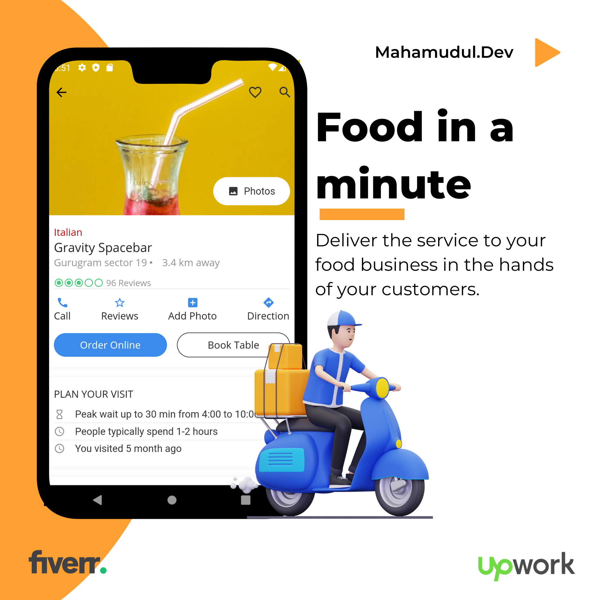
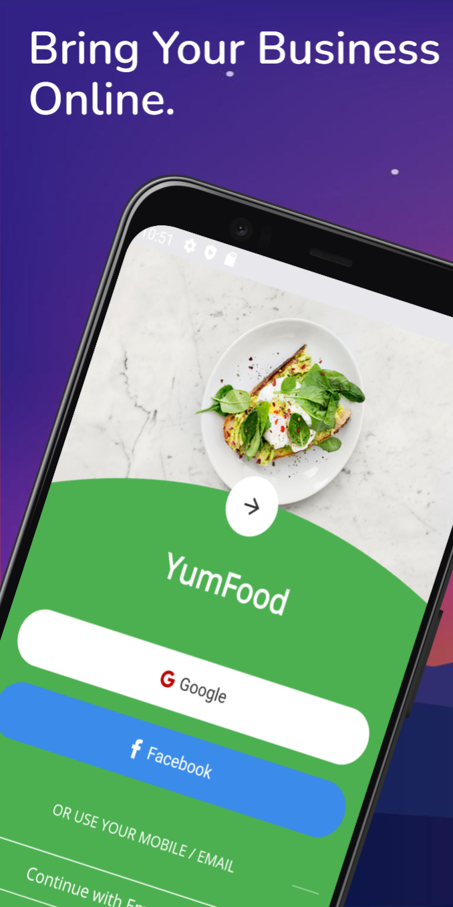
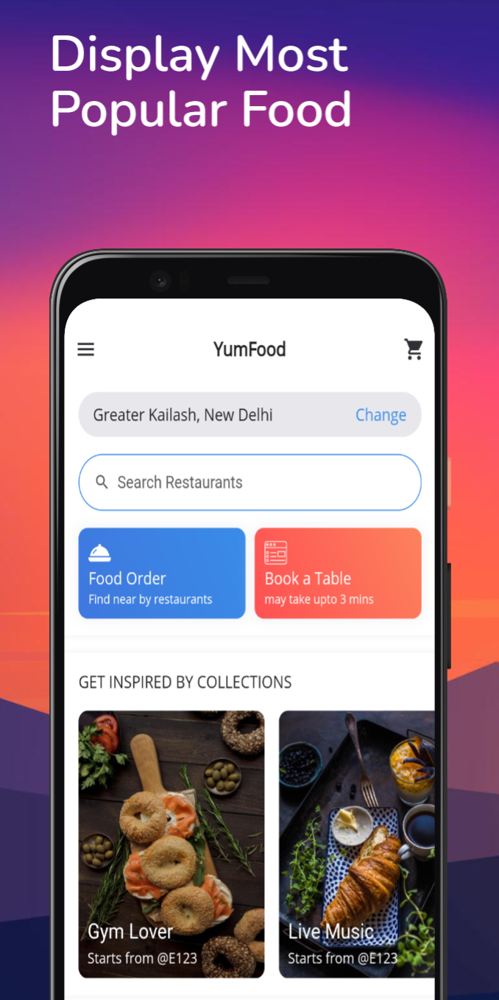
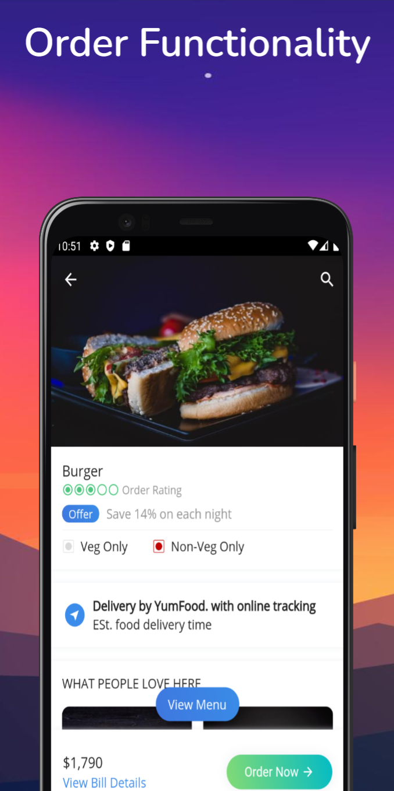
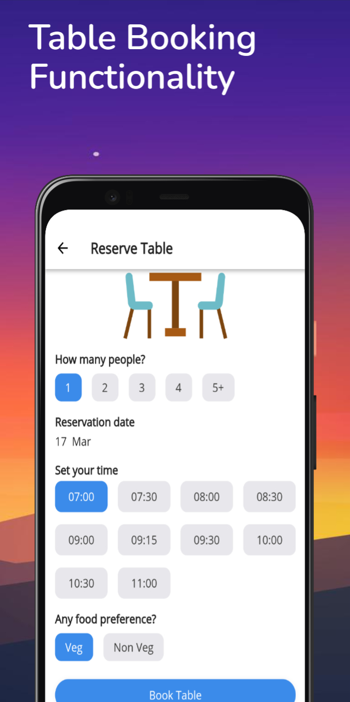

**Food Delivery App Screen shots:** 

   

**Advantage of food app for food business  **

Increased Revenue: A food delivery app allows customers to easily order food from their  favorite restaurants, which can increase the overall revenue of the business.  

Wider Reach: A food delivery app can help businesses expand their customer base by  reaching customers who may not have otherwise known about their restaurant or may not  have been able to physically visit their location.  

Enhanced Customer Experience: A food delivery app provides customers with a seamless  and convenient way to order food, allowing them to skip the hassle of waiting in line or  making a phone call. This can lead to an improved customer experience and increased  customer loyalty.  

Better Order Management: A food delivery app can help businesses manage their orders  more efficiently, reducing errors and ensuring that orders are fulfilled accurately and on  time. 

Increased Brand Awareness: A food delivery app can help businesses increase their brand awareness by featuring their restaurant on the app's platform, which can attract new customers and generate more exposure. 

Real-time Feedback: A food delivery app can provide businesses with real-time feedback from customers, which can help them improve their service and make necessary changes to their menu or operations. 
